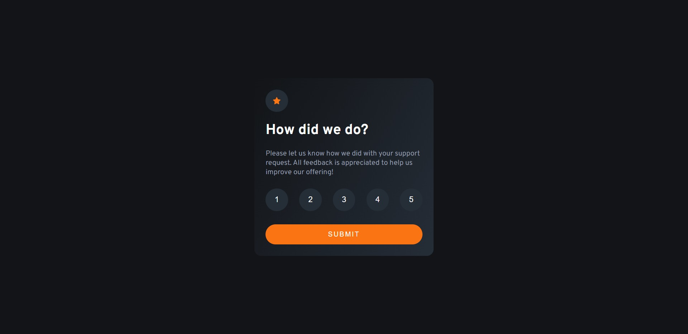
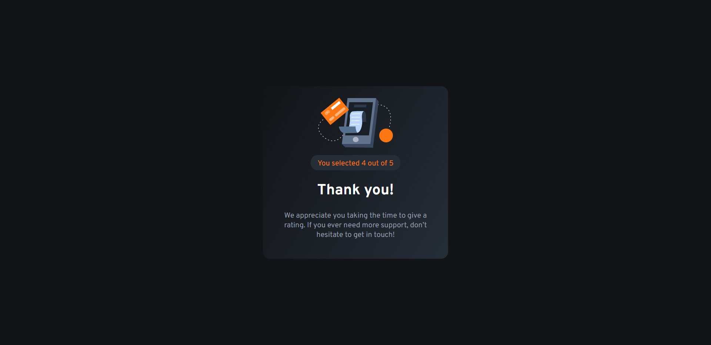

# Frontend Mentor - Interactive rating component solution

This is a solution to the [Interactive rating component challenge on Frontend Mentor](https://www.frontendmentor.io/challenges/interactive-rating-component-koxpeBUmI). 

## Table of contents

- [Overview](#overview)
  - [The challenge](#the-challenge)
  - [Screenshots](#screenshots)
  - [Links](#links)
- [My process](#my-process)
  - [Built with](#built-with)
  - [What I learned](#what-i-learned)
- [Author](#author)

**Note: Delete this note and update the table of contents based on what sections you keep.**

## Overview

### The challenge

The challenge is to build out this interactive rating component and get it looking as close to the design as possible. The given design is as follows: 


Users should be able to:

- View the optimal layout for the app depending on their device's screen size
- See hover states for all interactive elements on the page
- Select and submit a number rating
- See the "Thank you" card state after submitting a rating

### Screenshots




### Links

- Solution URL: [Add solution URL here](https://your-solution-url.com)
- Live Site URL: [Add live site URL here](https://your-live-site-url.com)

## My process

### Built with

- [React](https://reactjs.org/) - JS library
- CSS custom properties
- Flexbox

### What I learned

Some of my major learnings from this project are:

- Breaking down the UI into smaller components to keep my code as DRY as possible. I separated out the rating buttons into one components that I reused fives times. 
```js
    const CircleHighlight = (props) => {
        return (
            <button className='btn__rating' onClick={props.onClick}>{props.rating}</button>
        )
    }

    const ratings = [1, 2, 3, 4, 5].map(rating => {
        return (
            <CircleHighlight onClick={ratingClickHandler} key={rating} rating={rating}/>
        )
    })
```

- I learnt a lot of details on how to create a UI with optional elements, like the rating component here.

## Author

- Frontend Mentor - [@aditya-chakraborty](https://www.frontendmentor.io/profile/aditya-chakraborty)
- LinkedIn - [@Aditya Chakraborty](https://www.linkedin.com/in/aditya-chakraborty)
- Twitter - [@AdityaChkrabrty](https://www.twitter.com/AdityaChkrabrty)
